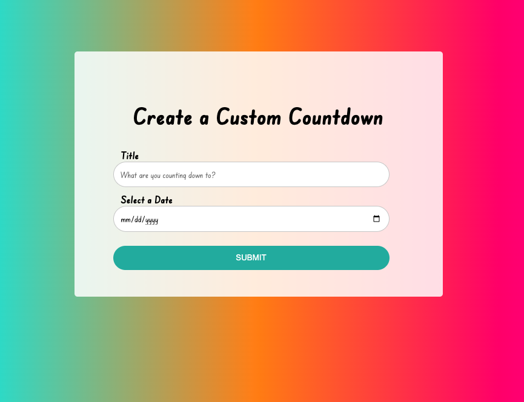

<h1 align="center">Countdown Timer</h1>

  <h3>
    <a href="https://globoivic.github.io/Music-Player/">
      Demo
    </a>
     | 
    <a href="https://github.com/GloBoiVic/Music-Player">
      Github Repo
    </a>
  </h3>

## :page_facing_up: General Information

Create a custom coundown timer that counts down to a future event date

## :computer: Tech Stack

- HTML
- CSS
- JavaScript

## :fire: Functionality

Countdown event will persist in browser using local storage

## :camera: Screenshots

## :bust_in_silhouette: Contact

GitHub [@GloBoiVic](https://github.com/GloBoiVic) - please reach out to me! I want to connect with other developers!
